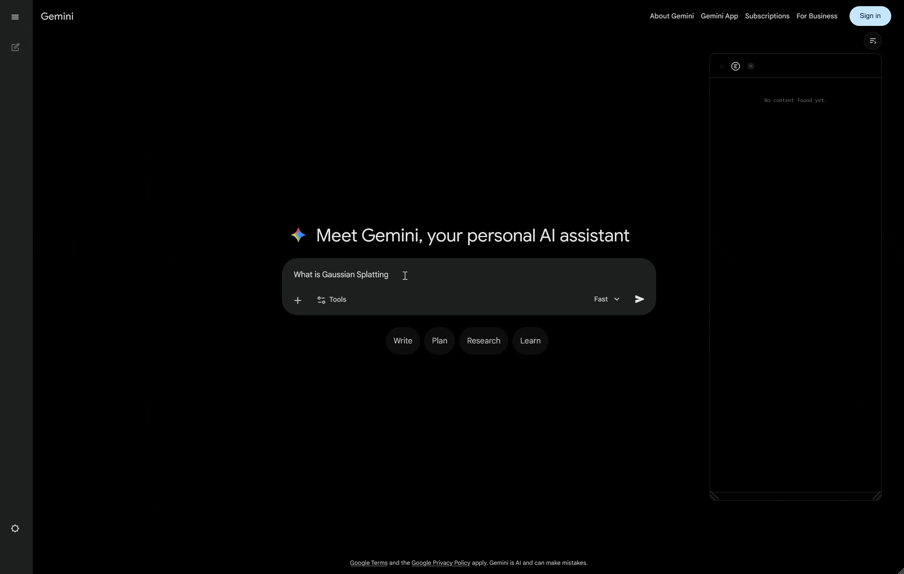

# Tocic

A browser extension that adds a **table-of-contents navigator widget** to Gemini, Grok, Claude, and ChatGPT conversations, and any page you configure.

Supports **Firefox** and **Chrome** (Manifest V3).

---

## Supported sites (built-in)

| Site | URL pattern |
|---|---|
| Claude | `claude.ai/chat/*` |
| Grok | `grok.com/c/*` |
| ChatGPT | `chatgpt.com/c/*`, `chat.openai.com/c/*` |
| Gemini | `gemini.google.com/app/*` |
| Any page | Via custom URL patterns (see below) |

---

## Screenshots

**Claude**


**Grok**


**Gemini**


---

## Installation

### Firefox
1. Open `about:debugging#/runtime/this-firefox`
2. Click **Load Temporary Add-on…**
3. Select `manifest.json` from this folder

### Chrome
1. Open `chrome://extensions`
2. Enable **Developer mode** (top right)
3. Click **Load unpacked**
4. Select this folder

---

## Widget

The widget appears as a floating panel on the right (or left) side of the page. It lists all user queries in the conversation as navigation items. Clicking an item scrolls to that query. The active item highlights as you scroll.

- **Collapse / expand** — click the widget icon button
- **Drag** — drag the header to reposition
- **Resize** — drag the bottom-right corner
- **Settings** — click the ⚙ gear icon inside the widget

### Sub-headings (document pages)

On non-chatbot pages (via custom URL patterns), the widget treats the page structure as a document:

- **h1** headings become top-level items (like user queries)
- **h2 / h3** headings expand underneath as sub-items (like bot responses)

---

## Browser popup

Click the Tocic icon in the browser toolbar to open the popup. It provides:

- **Per-site on/off toggle** — enable or disable the widget for the current site
- **Settings** — same appearance controls as the in-widget settings panel
- **Hotkeys** — configure keyboard shortcuts
- **Custom URL patterns** — manage which pages activate the widget

---

## Per-site toggle

The widget is **on by default** on built-in chatbot pages and any page matching a saved custom URL pattern. It is **off by default** everywhere else.

The toggle in the toolbar popup overrides the default for the current hostname:
- Flipping it back to the natural default removes the override entirely
- A hint below the toggle shows whether the current state is natural or forced

---

## Custom URL patterns

Activate the widget on any page — articles, documentation, wikis — by adding a URL pattern.

1. Open the popup (or widget settings)
2. Enter a **regex** matching the page URL, e.g. `https://x\.com/[^/]+/article/\d+`
3. Optionally add a label (shown in the widget header)
4. Click **Add**

Clicking an existing pattern opens it for inline editing. The × button removes it.

---

## Hotkeys

Two actions can be bound to keyboard shortcuts. Defaults are unset.

| Action | Description |
|---|---|
| **Toggle widget** | Collapse or expand the widget |
| **Add page & enable** | Add the current page URL as a pattern and force-enable the widget |

### Recording a hotkey

1. Open the popup or widget settings → **Hotkeys** section
2. Click the input field for the action
3. Press your desired key combination (e.g. `Ctrl+Shift+T`)
4. The combo is saved immediately and active on the current page without a reload
5. Press **Backspace** or **Escape** while the field is focused to clear the binding

---

## Settings

Accessible from the widget gear icon or the popup. Changes apply live.

| Setting | Description |
|---|---|
| Position | Dock widget to left or right edge |
| Font size | Item text size |
| Text color | Item text colour |
| Background | Widget background colour |
| Accent color | Highlight and active-item colour |
| Settings font size | Font size inside the settings panel |
| Settings text color | Label colour inside the settings panel |

**Reset to defaults** restores all appearance settings. Custom URL patterns and hotkeys are not affected.

---

## Architecture

```
tocic-extension/
├── manifest.json   MV3 manifest — permissions, content script registration
├── settings.js     Storage, settings cache, site overrides, hotkeys, custom URLs
├── adapters.js     Per-site DOM parsing (one adapter object per site)
├── content.js      Widget UI, TOC building, scroll tracking, hotkey listener
├── widget.css      All widget and shared CSS (variables, controls, toggle, hotkeys)
├── popup.html      Browser action popup markup
├── popup.js        Popup logic — mirrors widget settings, sends messages to tab
├── popup.css       Popup-specific layout
└── icons/
```

### Adding a new built-in site

1. Open `adapters.js` and create a new adapter:
   ```js
   var myAdapter = {
     id: 'mysite.com',
     matches: function () {
       return location.hostname === 'mysite.com';
     },
     pairs: function () {
       // Return array of { userEl, botEl, text }
       // userEl — user message DOM element (scroll target)
       // botEl  — bot response DOM element (scanned for h1/h2/h3 sub-headings)
       // text   — label shown in the TOC widget
     }
   };
   ```
2. Add it to the `TocicAdapters` array at the bottom of `adapters.js` (before `customUrlAdapter`)
3. Add the URL pattern to `manifest.json` → `content_scripts[0].matches`
4. Add the same hostname check to `isNaturalPage()` in `popup.js`

---

## License

MIT
